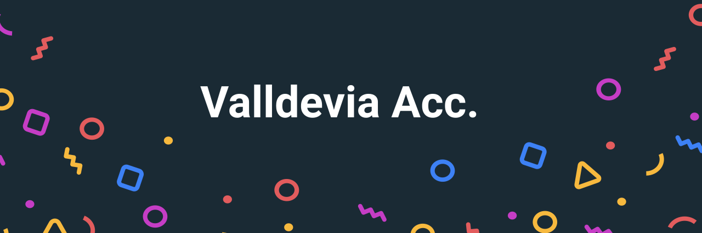

## Template <div align="right"> </img>
</div>

</img>

Goals:

Learn Vue 3 by in this full course. Vue.js is an open-source model–view–view model front end JavaScript framework for building user interfaces and single-page applications.
[Link to the course](https://youtu.be/FXpIoQ_rT_c) 


<h1 align="center"> Learning vue using Tailwindcss. </h1>

Vue (pronounced /vjuː/, like view) is a progressive framework for building user interfaces. Unlike other monolithic frameworks, Vue is designed from the ground up to be incrementally adoptable. The core library is focused on the view layer only, and is easy to pick up and integrate with other libraries or existing projects. On the other hand, Vue is also perfectly capable of powering sophisticated Single-Page Applications when used in combination with modern tooling and supporting libraries.

#Adding the App

```html
<!-- Using id="app", at the end of the script we can call the id to know what element tag we want to link with the script -->
<!-- v-cloak we use to parse the moment where the vue are loading and for a split second we can see the embended code -->

<body id="app" v-cloak>
    <div>
<!-- How to call a variable in vue -->
      <p class=" text-center "> {{greeting}} </p>
    </div>
</body>

<!-- We use {{}} double mustache to get the variable from the bottom of the script tag-->

```

#Buttons

```html

<div class="flex">
                <!-- v-on takes an event and check if is true or false waiting for a click event -->
                <button v-on:click="isVisible=!isVisible" class="p-6 border border-blue-400 ml-6">
                    Show Footer
                </button>
                <!-- The same thing but with a @event listener-->
                <button @click="toggleBox" class="p-6 border border-indigo-400 ml-6">
                    Show Footer
                </button>
            </div>

```

```js
  // <!-- Adding Vue -->
    <script src="https://unpkg.com/vue@next"></script>
    <script>

// Create a variable to initiate the app with a function callde createApp()

// Inside we can call a data where we can find a object returning variables
        let app = Vue.createApp({
            data: function () {
                return {
                    greeting: 'Hello Vue3!',
                    isVisible: false,
                }
            },
            
// Inside the createApp() function, we can add as many methods and components and objects as we like
// Here a simple toggle button.
            methods: {
                // !NOTE We could use fuction 
                // toggleBox: function () {
                //     return {
                //         toggleBox: this.isVisible = !this.isVisible
                //     }

                // }
                // !NOTE Or we just use a direct function
                toggleBox() {
                    this.isVisible = !this.isVisible
                }
            },
        })
        //!TODO Components


// At the end we can mount the app using the id 
        app.mount('#app')
    </script>
```


<div align="right">
  
Designed with:
  
++ [Freecodecamp](https://www.freecodecamp.org):
  
++ [Tailwindcss](https://tailwindcss.com/docs)

     
</div>

